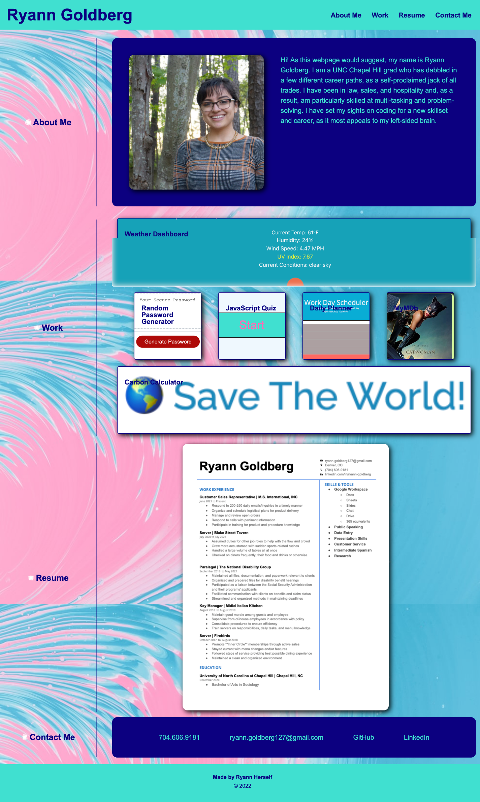

# advanced-CSS-RGportfolio

This is my first code from scratch. It is the beginning of my portfolio for future employers that includes all necessary information about me, including examples of my previous work in code. 

A homework assignment given from Bootcamp to learn about HTML and CSS

## Functionality of Website and Points of Interest

When you hover over my links, it highlights in an orchid color. 

When clicked on, my links send you either to the correct section of my portfolio, the sites of my previous projects, or ways in which to contact me.

The webpage adapts to the size of the screen.

You are able to see information about me, my work, and my contact information in an organized and intuitive way.

## Website Link and Screenshot

https://ryann127.github.io/advanced-CSS-RGportfolio/

## Contributors
- Ryann Goldberg (ryann.goldberg127@gmail.com)

